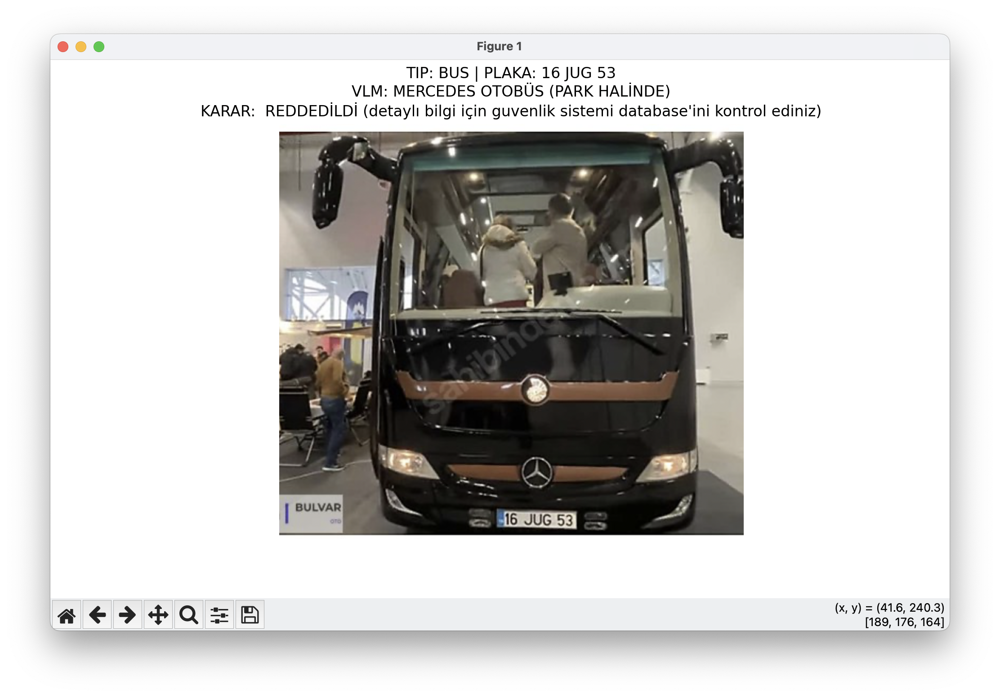
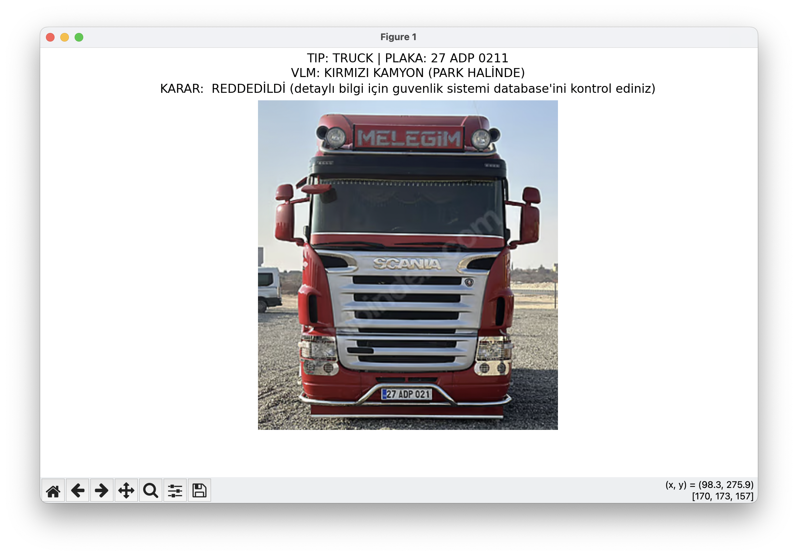
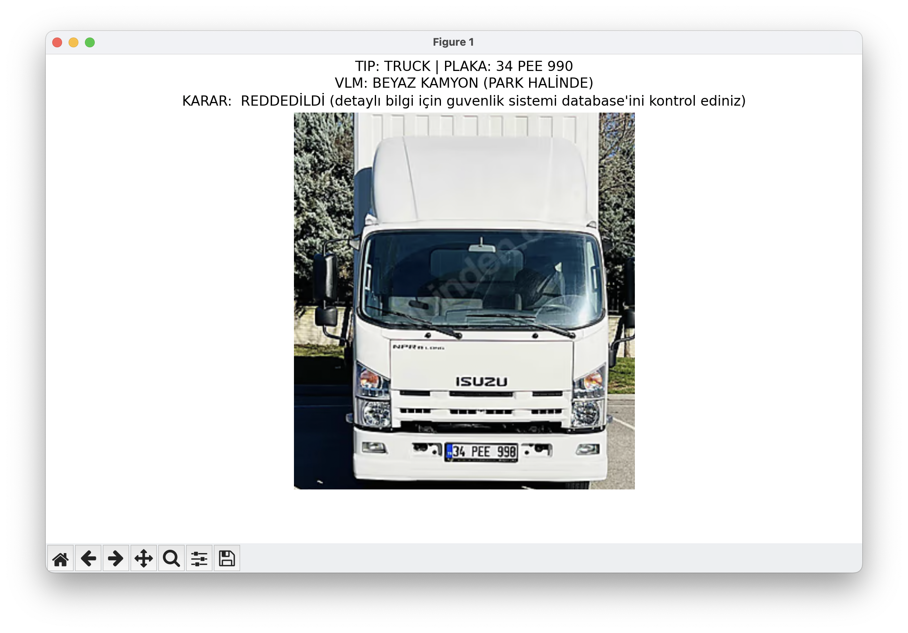
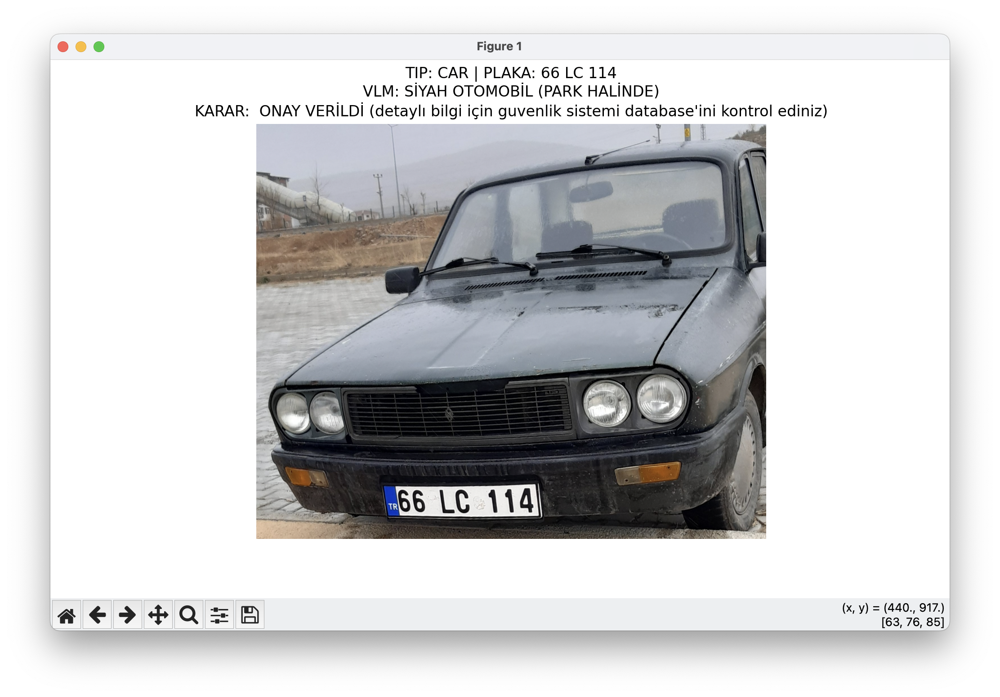
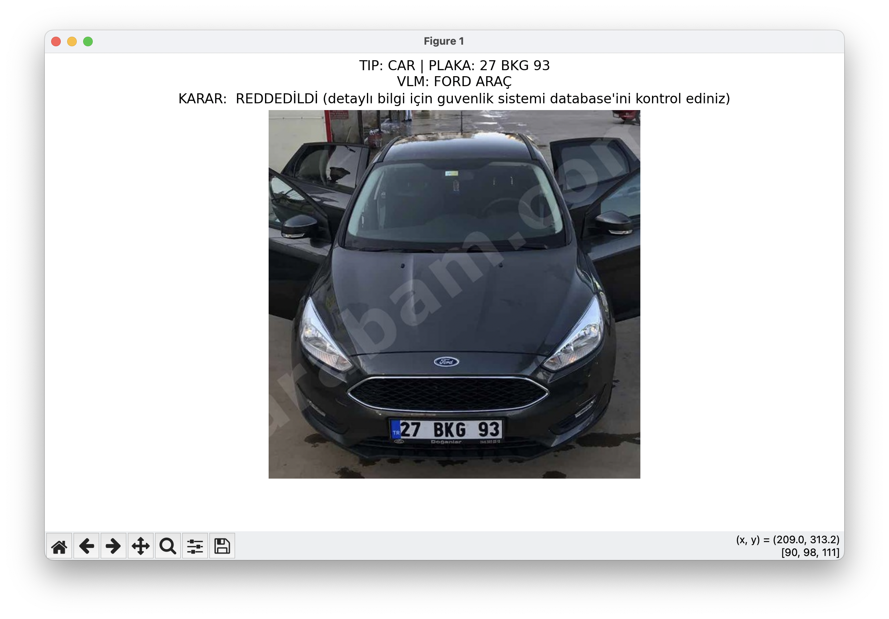
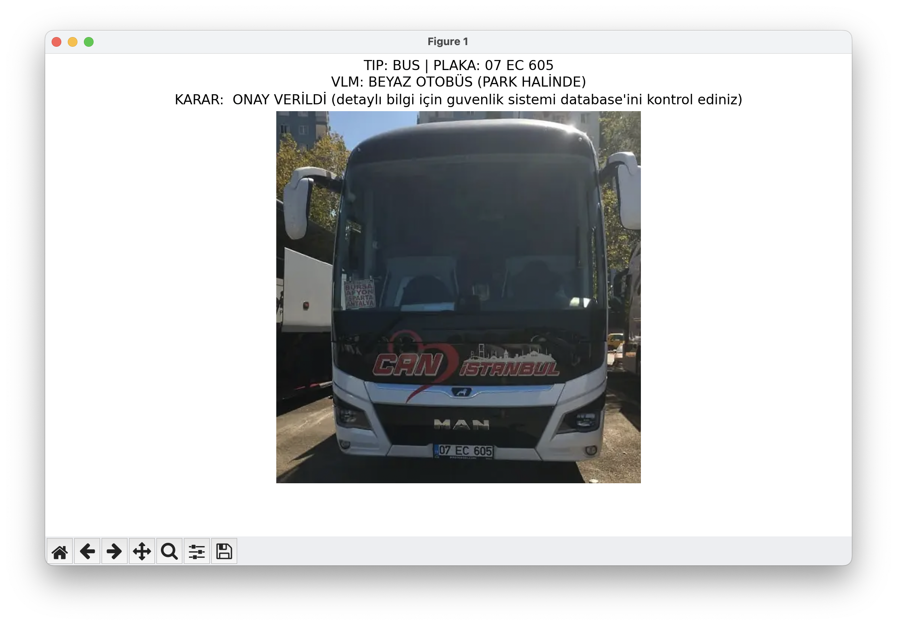

# proje videosu
[](https://youtu.be/gvkAfTP_aAs)


#  Vehicle License Plate Security System

projenin amacı,otopark girişlerinde araçları türlerine göre ayırt eden(YOLOv8), plakalarını okuyan(OCR) ve görsel dil modelleri (VLM-BLIP) kullanarak araç hakkında detaylı açıklama (renk, marka, durum) yapan bir güvenlik sistemi oluşturmaktır.Tespit edilen verileri kayıtlı bir database ile  karşılaştırarak otomatik geçiş onayı verir ve tüm süreci database'e loglar.


Araç tespiti: araba, otobüs, kamyon


plaka tespiti: türk plakaları için optimize edilmis OCR


araç renk, tip ve hareket durumuna göre analiz yapan VLM modeli


analiz edilen araçlara ait raporlama


izin durumu kontrolü için veritabanı


# proje yapısı
```python 
# proje yapısı
├── main.py               # Ana sistem
├── yolo_train.py         # Model eğitimi
├── models/
│   └── license_plate_detector.pt # ocr ile beraber kullanılan model
├── images/              #test görselleri
├── ham_veriler/         # Ham eğitim verisi
      └── car
      └──bus
      └── truck

├── dataset/             # İşlenmiş dataset
        └──train
        └──val
      
└── guvenlik_sistemi.db  # izin durumlarını ve geçişleri tutan veritabanı
```


#teknik detaylar


# yolo_train.py dosyası detayları

YOLOv8 sınıflandırma modelini eğitmek için kullanılır. Ham veriyi temizler ve model eğitimini gerçekleştirir.

Veri Temizliği : hashlib kullanılarak aynı içeriğe sahip görsellerden sadece biri kulllanılır.

Veri Seti Bölümleme: Veriler %80 eğitim (train) ve %20 doğrulama (val) olarak rastgele karıştırılarak ayrılır.

YOLOv8  Eğitimi: yolov8n-cls.pt modeli kullanılarak otobüs, araba ve kamyon sınıfları üzerine özel bir eğitim gerçekleştirilir.


```python
import os
import shutil
import random
import hashlib
from ultralytics import YOLO
```
gerekli kütüphaneler eklendi.


```python
def dosya_hash_hesapla(dosya_yolu):
    """Dosyanın içeriğine göre benzersiz bir parmak izi (hash) oluşturur."""
    hasher = hashlib.md5()
    with open(dosya_yolu, 'rb') as f:
        hasher.update(f.read())
    return hasher.hexdigest()
```
hash hesaplama ile her görsele ait özel bir hash oluşturduk böylece aynı görselin birden fazla kez dataset'e eklenmesinin önüne geçtik.


```python

def dosya_hash_hesapla(dosya_yolu):
    """Dosyanın içeriğine göre benzersiz bir parmak izi (hash) oluşturur."""
    hasher = hashlib.md5()
    with open(dosya_yolu, 'rb') as f:
        hasher.update(f.read())
    return hasher.hexdigest()

```
bir hedef dizin oluşturduk, datasetimizi buraya yerleştireceğiz.


```python
 siniflar = ['bus', 'car', 'truck']
for sinif in siniflar:
        src_path = os.path.join(kaynak_dizin, sinif)
        if not os.path.exists(src_path):
            continue
```
kullanılacak sınıflar tanımlandı.
Her sınıf için döngü başlatıldı, kaynak klasörün yolu oluşturuldu ve klasör yoksa bir sonrakine geçti


```python
benzersiz_resimler = []
        hash_listesi = set()

        for dosya in os.listdir(src_path):
            yol = os.path.join(src_path, dosya)
            if not os.path.isfile(yol):
                continue

            parmak_izi = dosya_hash_hesapla(yol)
            if parmak_izi not in hash_listesi:
                hash_listesi.add(parmak_izi)
                benzersiz_resimler.append(dosya)
```
dosyaları kontrol etti, hashleri hesapladı böylece birden fazla aynı görsel varsa sadece birini aldı.


```python
random.shuffle(benzersiz_resimler)
        sinir = int(len(benzersiz_resimler) * train_orani)
train_yol = os.path.join(hedef_dizin, 'train', sinif)
        val_yol = os.path.join(hedef_dizin, 'val', sinif)
        os.makedirs(train_yol, exist_ok=True)
        os.makedirs(val_yol, exist_ok=True)
for i, img in enumerate(benzersiz_resimler):
            kaynak = os.path.join(src_path, img)
            hedef = train_yol if i < sinir else val_yol
            shutil.copy(kaynak, os.path.join(hedef, img))

        print(f"{sinif.upper()} | Toplam: {len(benzersiz_resimler)}")

```
görselleri rastgele biçimde train ve val olarak böldü.


```python
if __name__ == "__main__":
    # Dataset'i hazırla
    temiz_dataset_olustur(
        kaynak_dizin="ham_veriler",
        hedef_dizin="dataset"
    )
# YOLOv8 Classification eğitimi
    model = YOLO("yolov8n-cls.pt")
    model.train(
        data="dataset",
        epochs=20,
        imgsz=224
    )
```
üstteki fonksiyonları çalıştırarak ham_veriler içerisindeki görselleri Dataset klasörü içerisine yolonun istediği formatta (train ve val klasörleri halinde ) gönderdi.
yolo8n classification modelini kullanarak eğitime başladı.


# main.py dosyası detayları


Araç Tespiti (Object Detection):
eğitilen modeli kullanılarak karedeki nesneler bulunur.

Plaka Tespiti ve OCR :
Segmentasyon: Araç görseli içerisinden plaka bölgesi (license_plate_detector.pt) ile tespit edilir.
Görüntü İyileştirme: Plaka okunmadan önce CLAHE (kontrast artırma) ve Otsu Threshold (ikili siyah-beyaz görüntü) teknikleriyle temizlenir.
Gelişmiş Okuma: EasyOCR ile farklı ölçeklerde denemeler yapılır.
Format Kontrolü: Okunan metin, Türk plaka formatına uygunluk açısından bir kontrol mekanizmasından geçer.

Görsel Dil Modeli (VLM) Analizi:
BLIP modeli kullanılarak araç hakkında renk model ve hareket bilgilerinden açıklama üretilir.


Karar Verme:
SQLite veri tabanındaki "izinli_plakalar" tablosu kontrol edilir.
Eğer plaka listede varsa ve kamyon değilse ONAY VERİLDİ yoksa ya da  okunamadıysa REDDEDİLDİ kararı verilir.

Kayıt  ve Görselleştirme:
Plaka, araç tipi, VLM yorumu,geçiş bilgisi, tarih ve saat bilgileri gecis_loglari tablosuna kaydedilir.
Matplotlib ile sonuçlar kullanıcıya görsel olarak sunulur.


```python
import cv2
import os
import sys
import torch
import sqlite3
import numpy as np
import matplotlib.pyplot as plt
from PIL import Image
from datetime import datetime
import easyocr
from ultralytics import YOLO
from transformers import BlipProcessor, BlipForConditionalGeneration

BASE_DIR = os.path.dirname(os.path.abspath(__file__))

if BASE_DIR not in sys.path:
    sys.path.append(BASE_DIR)

device = "cuda" if torch.cuda.is_available() else "cpu"
print(f"🔧 Kullanılan cihaz: {device}")

```
kütüphaneler eklendi, gerekli dizin ayarları ve kullanılacak cihaz seçimleri yapıldı 


```python
reader = easyocr.Reader(['en', 'tr'], gpu=(device == "cuda"))
coco_model = YOLO(os.path.join(BASE_DIR, "yolov8n.pt")) # eğitilen modeli kullan, bulamazsan hazır eğitişmiş olanı kullan
license_plate_detector = YOLO(os.path.join(BASE_DIR, "models", "license_plate_detector.pt"))
processor = BlipProcessor.from_pretrained("Salesforce/blip-image-captioning-base")
vlm_model = BlipForConditionalGeneration.from_pretrained("Salesforce/blip-image-captioning-base").to(device)

```
gerekli modeller yüklendi.


```python
def db_hazirla():
    conn = sqlite3.connect("guvenlik_sistemi.db")
    c = conn.cursor()
c.execute("""CREATE TABLE IF NOT EXISTS izinli_plakalar (plaka TEXT PRIMARY KEY)""")
c.execute("""CREATE TABLE IF NOT EXISTS gecis_loglari (
        id INTEGER PRIMARY KEY AUTOINCREMENT,
        plaka TEXT, arac_tipi TEXT, vlm_yorum TEXT, durum TEXT, tarih TEXT, saat TEXT
    )""")

ornek_plakalar = [("07EC605",), ("66LC114",)]
    c.executemany("INSERT OR IGNORE INTO izinli_plakalar VALUES (?)", ornek_plakalar)
    conn.commit()
    conn.close()

```
veri tabanı oluşturuldu, izinli araç plakaları ve geçiş logları oluşturuldu


```python
def plaka_izinli_mi(plaka):
    if not plaka or plaka == "OKUNAMADI": return False

conn = sqlite3.connect("guvenlik_sistemi.db")
    c = conn.cursor()
    c.execute("SELECT 1 FROM izinli_plakalar WHERE plaka=?", (plaka,))
    r = c.fetchone()
    conn.close()
    return r is not None
```
 veritabanına bağlanıp plakanın izinli olup olmadığı kontrol edildi.
 


```python
def log_kaydet(plaka, tip, vlm, durum):
    conn = sqlite3.connect("guvenlik_sistemi.db")
    c = conn.cursor()
    now = datetime.now()

c.execute("""INSERT INTO gecis_loglari (plaka, arac_tipi, vlm_yorum, durum, tarih, saat)
                 VALUES (?,?,?,?,?,?)""", (plaka, tip, vlm, durum, now.strftime("%Y-%m-%d"), now.strftime("%H:%M:%S")))
    conn.commit()
    conn.close()
```
veritabanına bağlanarak o güne ait tarih ve saatle birlikte gelen aracın bilgilerini loglandı.


```python
def plaka_on_isleme(img):
    gray = cv2.cvtColor(img, cv2.COLOR_BGR2GRAY)
clahe = cv2.createCLAHE(2.0, (8, 8)).apply(gray)
bilateral = cv2.bilateralFilter(gray, 11, 17, 17)
    _, thresh = cv2.threshold(bilateral, 0, 255, cv2.THRESH_BINARY + cv2.THRESH_OTSU)
    return [clahe, thresh]
```
plaka ön işlemeden geçirildi (gri formata getirildi, kontrası arttırdı, fürültü azaltıldı,ikili görsel oluşturuldu)


```python
def turk_plaka_formatla(text):
    text = text.replace("TR", "").replace(" ", "").upper()
il = ""
    for c in text:
        if c.isdigit():
            il += c
        else:
            break
    if not (1 <= len(il) <= 2): return None
kalan = text[len(il):]
    harf = ""
    for c in kalan:
        if c.isalpha():
            harf += c
        else:
            break
    if not (1 <= len(harf) <= 3): return None
num = kalan[len(harf):]
    if not num.isdigit() or not (1 <= len(num) <= 4): return None

    return f"{il} {harf} {num}"
```
türk plakasını kabul eecek biçimde formatlandı ( tr ülke kodu ve boşluklar kaldırıldı tüm harfler büyük yapıldı, il kodu çıkarıldı [34 ABC kabul edilsin , 342 ABC reddedilsin] , ilden sonra gelen harfler toplandı, harflerden sonraki kısım sadece sayılardan oluşmalı)

not: bu sistem ocr'ın plakadaki sayı ve harfleri okuyabilmesinden ancak birleştirmemesinden ayrıca resim içerisindeki farklı kelimeleri plaka olarak kabul etmesinden dolayı oluşturulmuştur.


```python
def plaka_oku_coklu_deneme(plate_crop):
    tum_adaylar = []
    print("\n" + "=" * 50 + "\n🔎 PLAKA ANALİZİ BAŞLADI\n" + "=" * 50)

for scale in [2.5, 3.0]:
        resized = cv2.resize(plate_crop, None, fx=scale, fy=scale, interpolation=cv2.INTER_CUBIC)

for i, img in enumerate(plaka_on_isleme(resized)):
            results = reader.readtext(img, allowlist="0123456789ABCDEFGHIJKLMNOPQRSTUVWXYZ ", paragraph=True)

for res in results:
                if len(res) == 3:
                    _, text, conf = res
                elif len(res) == 2:
                    _, text = res
                    conf = 0.90
                else:
                    continue

clean = text.replace(" ", "").upper()
                print(f"    [OCR] Ham/Birleşik Metin: '{clean}'")

                formatted = turk_plaka_formatla(clean)
                if formatted:
                    print(f"    [✓] FORMAT ONAYLI: {formatted}")
                    tum_adaylar.append((formatted, conf))
                else:
                    print(f"    [X] FORMAT HATASI: '{clean}' katı kurallara uymuyor.")

if tum_adaylar:
        tum_adaylar.sort(key=lambda x: x[1], reverse=True)
        final = tum_adaylar[0][0]
        print(f"\n🏆 FİNAL KARAR: {final}\n" + "=" * 50)
        return final

    print("\n❌ SONUÇ: OKUNAMADI\n" + "=" * 50)
    return "OKUNAMADI"


```
plakayı farklı ölçekler ve ön işlemeyle ocr'a vererek en güvenli seçeneği bulur.


``` python
def vlm_ile_arac_analizi(arac_crop):
    try:
        rgb_img = cv2.cvtColor(arac_crop, cv2.COLOR_BGR2RGB)
        pil_img = Image.fromarray(rgb_img)

        target_size = 224 if device == "cpu" else 384
        pil_img = pil_img.resize((target_size, target_size), Image.LANCZOS)

        inputs = processor(images=pil_img, return_tensors="pt").to(device)

        outputs = vlm_model.generate(
            **inputs,
            max_new_tokens=60 if device == "cpu" else 80,
            num_beams=3 if device == "cpu" else 5,
            repetition_penalty=1.3,
            length_penalty=1.2,
            early_stopping=True,
            do_sample=False
        )

        caption = processor.decode(
            outputs[0],
            skip_special_tokens=True
        ).upper().strip()
        tipler = {
            'OTOBÜS': ['BUS', 'MINIBUS'],
            'KAMYON': ['TRUCK', 'LORRY', 'VAN'],
            'SEDAN': ['SEDAN'],
            'SUV': ['SUV', 'JEEP'],
            'HATCHBACK': ['HATCHBACK'],
            'OTOMOBİL': ['CAR', 'VEHICLE']
        }

        tespit_edilen_tip = None
        for tip, anahtarlar in tipler.items():
            if any(a in caption for a in anahtarlar):
                tespit_edilen_tip = tip
                break
        markalar = [
            'BMW', 'MERCEDES', 'AUDI', 'TOYOTA',
            'HONDA', 'FORD', 'VOLKSWAGEN',
            'RENAULT', 'FIAT', 'OPEL'
        ]

        tespit_edilen_marka = None
        for marka in markalar:
            if marka in caption:
                tespit_edilen_marka = marka
                break
        yorum = []
        if tespit_edilen_renk:
            yorum.append(tespit_edilen_renk)
        if tespit_edilen_marka:
            yorum.append(tespit_edilen_marka)
        if tespit_edilen_tip:
            yorum.append(tespit_edilen_tip)

        return " ".join(yorum) if yorum else "DETAY TESPİT EDİLEMEDİ"

    except:
        return "ANALİZ BAŞARISIZ"

```
blip modeline araç görselini vererek açıklama ürettirir (renk, model, hareket durumu)


``` python
def guvenli_crop(img, x1, y1, x2, y2, pad=30):
    h, w = img.shape[:2]
    return img[
        max(0, y1 - pad):min(h, y2 + pad),
        max(0, x1 - pad):min(w, x2 + pad)
    ]

```
 plaka tespiti yapan licence_plate_detection'ın verdiği bounding boxlar dar olabileceği için alanı genişletir.


``` python
def final_guvenlik_denetimi(resim_yolu):
    db_hazirla()
    frame = cv2.imread(resim_yolu)

    if frame is None:
        return

```
ana sistem çalışınca veritabanı hazırlanır,  test görüntüleri okunur


``` python
    results = coco_model(frame, conf=0.5, verbose=False)

    for r in results[0].boxes:
        label = coco_model.names[int(r.cls[0])]
        if label not in ["car", "bus", "truck"]:
            continue
        x1, y1, x2, y2 = map(int, r.xyxy[0])
        arac_crop = guvenli_crop(frame, x1, y1, x2, y2)

        plates = license_plate_detector(arac_crop, conf=0.3, verbose=False)
        plaka = "OKUNAMADI"

        if plates[0].boxes:
            px1, py1, px2, py2 = map(int, plates[0].boxes[0].xyxy[0])
            plaka = plaka_oku_coklu_deneme(
                arac_crop[py1:py2, px1:px2]
            )
        vlm_yorum = vlm_ile_arac_analizi(arac_crop)

        izinli = plaka_izinli_mi(plaka)
        karar = "ONAY VERİLDİ" if izinli else "REDDEDİLDİ"

        log_kaydet(plaka, label.upper(), vlm_yorum, karar)

if __name__ == "__main__":
    images_dir = os.path.join(BASE_DIR, "images")

    if os.path.exists(images_dir):
        for img in os.listdir(images_dir):
            if img.lower().endswith(('.jpg', '.png', '.jpeg')):
                final_guvenlik_denetimi(
                    os.path.join(images_dir, img)
                )
```
image klasöründeki tüm görseller için,
yolo ile tespit yapılır
plaka tespit edilir ve ocr ile okunur
izin kontrolü yapılır sonuçlar loglanır


# test görsel çıktıları








